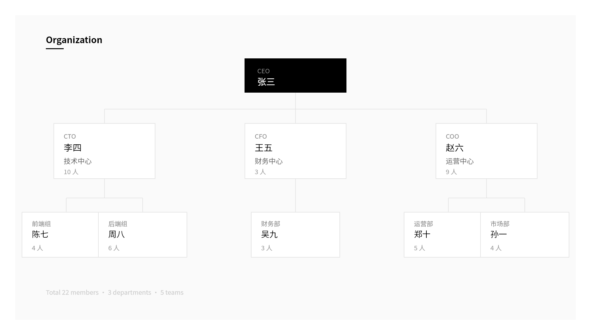
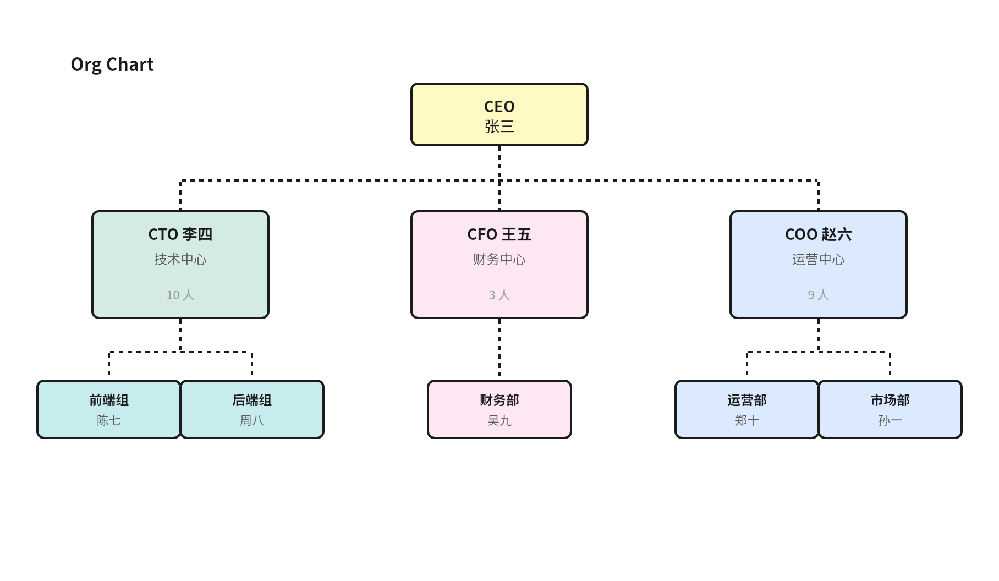
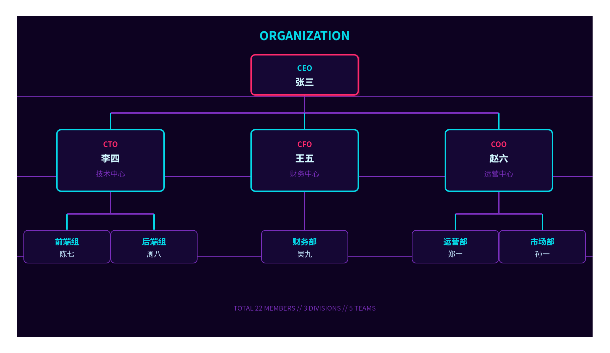
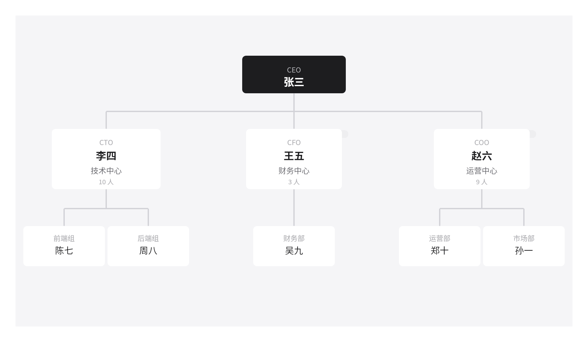
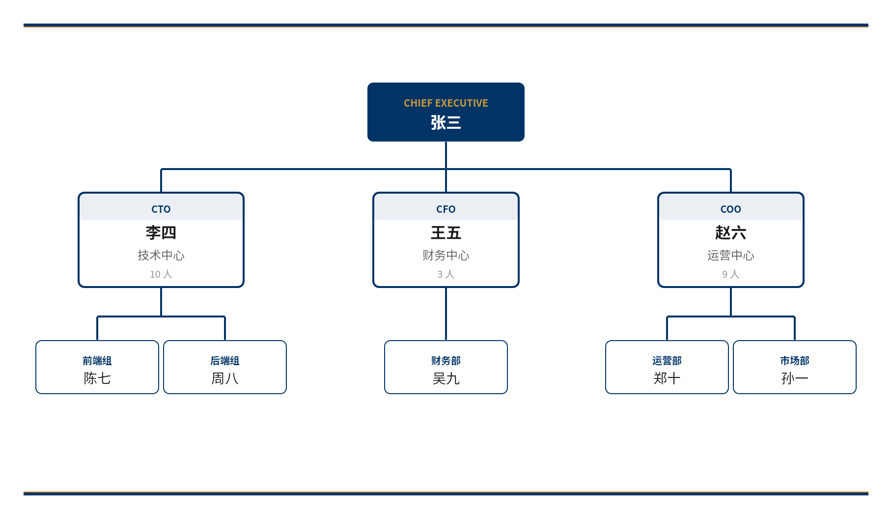

# whiteboard-styles

飞书画板风格库 — 为 Claude Code 画板创作提供 22 种可复用视觉风格模板。

## 简介

这是一个 [Claude Code Skill](https://docs.anthropic.com/en/docs/claude-code/skills)，配合 [lark-whiteboard](https://github.com/larksuite/cli) skill 使用，在创建飞书画板 SVG/DSL 时自动应用预设的视觉风格。

## 风格示例

| Vercel | Excalidraw |
|:---:|:---:|
|  |  |
| 黑白灰、零圆角、工程师美学 | 手绘线条、彩色便签、白板协作 |

| Neon | Apple |
|:---:|:---:|
|  |  |
| 霓虹发光、赛博朋克、未来感 | 大圆角、精致留白、简约高端 |

| Corporate | |
|:---:|:---:|
|  | |
| 深蓝金配色、稳重正式、商务汇报 | |

## 安装

在 Claude Code 中直接对 AI 说：

```
帮我安装这个 skill: https://github.com/inhai-wiki/whiteboard-styles
```

AI 会自动下载并安装到 `~/.claude/skills/whiteboard-styles/`。

或者手动安装：

```bash
git clone https://github.com/inhai-wiki/whiteboard-styles.git ~/.claude/skills/whiteboard-styles
```

## 使用方式

安装后，在 Claude Code 对话中画图时直接指定风格：

```
画一个组织架构图，用 Vercel 风格
```

```
帮我画个技术架构图，GitHub 风格
```

```
用赛博朋克风格画个流程图
```

```
画个组织架构图，Notion 那种感觉
```

不指定风格时，skill 会根据图表类型和场景自动推荐最合适的风格。

## 包含风格（22 种）

| # | 风格 ID | 灵感来源 | 关键词 |
|---|---|---|---|
| 1 | `vercel` | Vercel | 黑白灰、零圆角、工程师美学 |
| 2 | `apple` | Apple | 大圆角、精致留白、SF 风格 |
| 3 | `notion` | Notion | 超轻边框、文档内嵌感 |
| 4 | `figma` | Figma | 彩色标签、网格系统 |
| 5 | `excalidraw` | Excalidraw | 手绘线条、便签黄、白板协作 |
| 6 | `miro` | Miro | 彩色便利贴、团队协作 |
| 7 | `material` | Material Design | Google 设计语言、阴影层级 |
| 8 | `ant-design` | Ant Design | 阿里设计体系、专业蓝 |
| 9 | `github` | GitHub | 深色代码感、等宽风 |
| 10 | `stripe` | Stripe | 精致渐变、科技紫 |
| 11 | `linear` | Linear | 深色、紫色调、项目管理 |
| 12 | `whimsical` | Whimsical | 柔和圆角、淡彩 |
| 13 | `lucidchart` | Lucidchart | 标准流程图、企业蓝灰 |
| 14 | `dark-mode` | Catppuccin Mocha | 深色背景、高对比 |
| 15 | `neon` | Cyberpunk 2077 | 霓虹发光、未来感 |
| 16 | `blueprint` | 建筑蓝图 | 深蓝底色、工程图纸 |
| 17 | `pastel` | 马卡龙色系 | 柔和淡彩、温馨 |
| 18 | `corporate` | 咨询报告 | 深蓝金配色、稳重 |
| 19 | `minimal` | Dieter Rams | 最少元素、最大留白 |
| 20 | `monochrome` | 报纸印刷 | 纯黑白、无彩色 |
| 21 | `isometric` | 技术插画 | 等距投影、2.5D |
| 22 | `duotone` | Spotify Wrapped | 双色高对比、海报感 |

## 文件结构

```
whiteboard-styles/
├── SKILL.md                          # 主入口：触发规则、工作流、风格路由
├── README.md                         # 本文件
├── examples/                         # 风格示例截图
│   ├── vercel.png
│   ├── excalidraw.png
│   ├── neon.png
│   ├── apple.png
│   └── corporate.png
└── references/
    ├── style-catalog.md              # 完整风格参数库（配色、形状、字体、连线）
    └── scene-style-mapping.md        # 图表类型 × 场景 × 推荐风格映射
```

## 每个风格包含的参数

- **palette** — 配色方案（背景、卡片、主色、边框、文字、强调色）
- **shape** — 形状参数（圆角、边框宽度、阴影）
- **typography** — 字体规范（字号层级、字重、字间距、大小写）
- **connector** — 连线风格（颜色、宽度、虚线/实线）
- **decoration** — 装饰规则（渐变、图标风格、额外点缀）

## License

MIT
