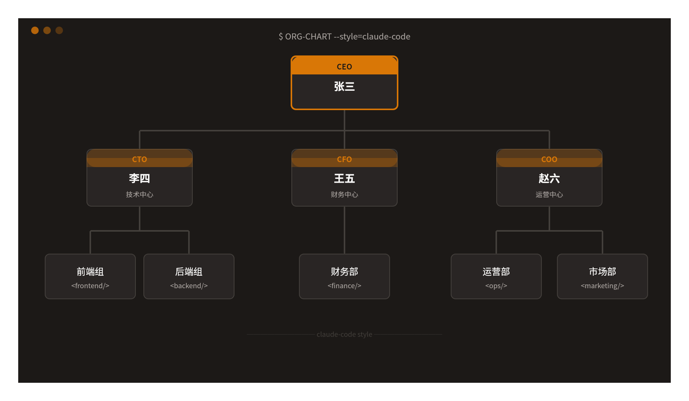
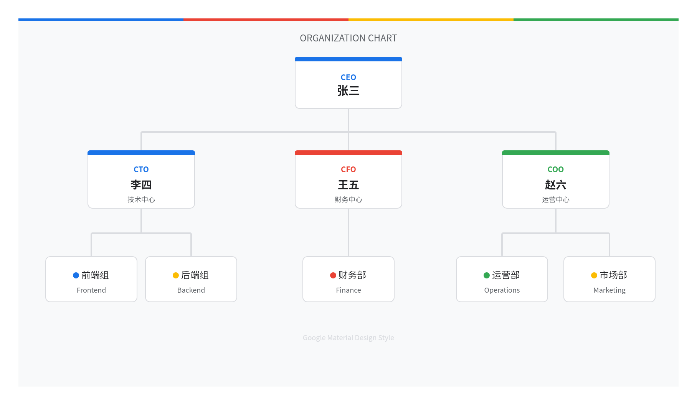
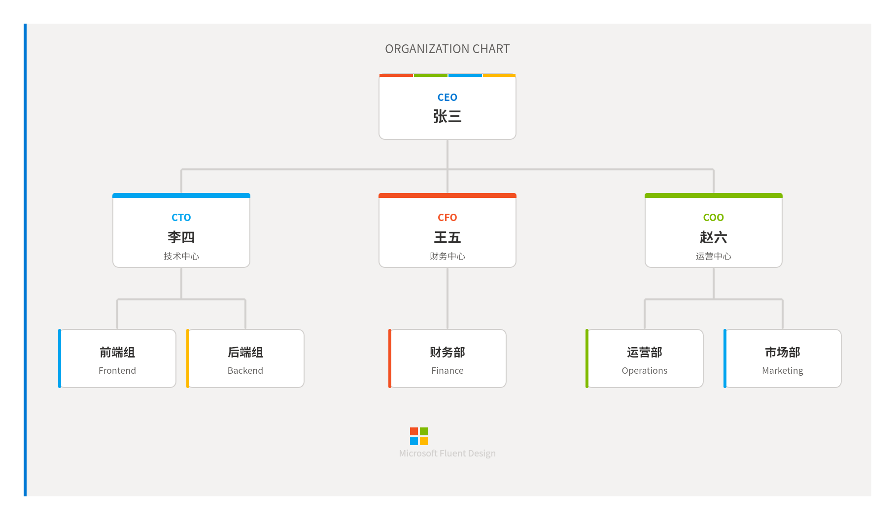
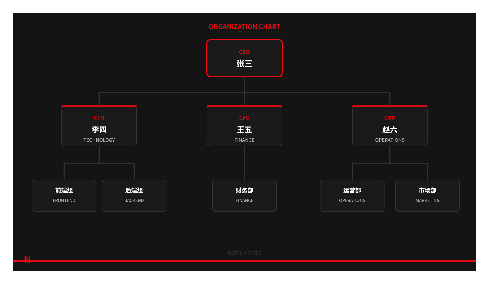
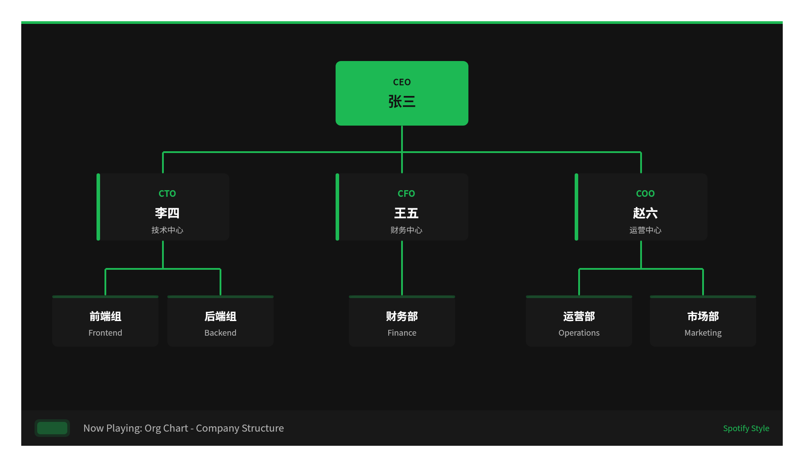

# whiteboard-styles

**飞书画板风格库** — 为 Claude Code + [lark-cli](https://github.com/larksuite/cli) 画板创作提供 32 种可复用视觉风格模板。

<p align="center">
  <a href="https://github.com/larksuite/cli">
    
  </a>
  
  
</p>

## 关系说明

本 skill 是 [lark-cli](https://github.com/larksuite/cli) 的配套风格库：

```
Claude Code (AI Agent)
  ├── lark-cli                          ← 飞书操作 CLI（创建画板、上传、查询）
  │     └── lark-whiteboard skill       ← 画板渲染引擎（SVG/DSL → 飞书画板）
  │           └── whiteboard-styles     ← 本项目（32 种视觉风格参数）
  └── 用户对话
        "用 Google 风格画个组织架构图"  → 自动匹配风格 → 生成 SVG → 渲染 → 上传飞书画板
```

## 风格示例

### 全球科技公司

| Claude Code | Google |
|:---:|:---:|
|  |  |
| 暖橙棕终端感、AI 原生 | 四色品牌、Material You |

| Microsoft | Netflix |
|:---:|:---:|
|  |  |
| Fluent Design、四色方格 | 深黑红、电影沉浸感 |

| Spotify | Apple |
|:---:|:---:|
|  |  |
| 深绿黑、活力绿、音乐感 | 大圆角、精致留白、简约高端 |

| Vercel | Excalidraw |
|:---:|:---:|
|  |  |
| 黑白灰、零圆角、工程师美学 | 手绘线条、彩色便签、白板协作 |

| Neon | Corporate |
|:---:|:---:|
|  |  |
| 霓虹发光、赛博朋克、未来感 | 深蓝金配色、稳重正式、商务汇报 |

## 安装

在 Claude Code 中直接对 AI 说：

```
帮我安装这个 skill: https://github.com/inhai-wiki/whiteboard-styles
```

或者手动安装：

```bash
git clone https://github.com/inhai-wiki/whiteboard-styles.git ~/.claude/skills/whiteboard-styles
```

## 使用方式

安装后，在 Claude Code 对话中画图时直接指定风格：

```
画一个组织架构图，用 Google 风格
```

```
帮我画个技术架构图，Claude Code 风格
```

```
用 Netflix 风格画个流程图
```

```
画个组织架构图存到飞书画板，用 Microsoft 风格
```

不指定风格时，skill 会根据图表类型和场景自动推荐最合适的风格。

## 全部风格（32 种）

### 全球科技公司

| # | 风格 ID | 品牌 | 关键词 |
|---|---|---|---|
| 23 | `claude-code` | Claude Code | 暖橙棕终端感、AI 原生 |
| 24 | `google` | Google | 四色品牌、Material You |
| 25 | `microsoft` | Microsoft | Fluent Design、四色方格 |
| 26 | `meta` | Meta/Facebook | 渐变蓝、现代社交科技 |
| 27 | `amazon` | Amazon/AWS | 深蓝橙、云计算企业级 |
| 28 | `netflix` | Netflix | 深黑红、电影沉浸感 |
| 29 | `spotify` | Spotify | 深绿黑、活力绿 |
| 30 | `tesla` | Tesla | 极简黑白红、工程美学 |
| 31 | `openai` | OpenAI | 柔和绿、AI 前沿 |
| 32 | `bytedance` | ByteDance/TikTok | 黑白粉青、短视频活力 |

### 设计工具 & 协作平台

| # | 风格 ID | 品牌 | 关键词 |
|---|---|---|---|
| 1 | `vercel` | Vercel | 黑白灰、零圆角、工程师美学 |
| 2 | `apple` | Apple | 大圆角、精致留白 |
| 3 | `notion` | Notion | 超轻边框、文档内嵌感 |
| 4 | `figma` | Figma | 彩色标签、网格系统 |
| 5 | `excalidraw` | Excalidraw | 手绘线条、便签黄、白板协作 |
| 6 | `miro` | Miro | 彩色便利贴、团队协作 |
| 7 | `material` | Material Design | Google 设计语言、阴影层级 |
| 8 | `ant-design` | Ant Design | 阿里设计体系、专业蓝 |
| 9 | `github` | GitHub | 深色代码感、等宽风 |
| 10 | `stripe` | Stripe | 精致渐变、科技紫 |
| 11 | `linear` | Linear | 深色、紫色调、项目管理 |
| 12 | `whimsical` | Whimsical | 柔和圆角、淡彩 |
| 13 | `lucidchart` | Lucidchart | 标准流程图、企业蓝灰 |

### 通用设计风格

| # | 风格 ID | 名称 | 关键词 |
|---|---|---|---|
| 14 | `dark-mode` | 深色模式 | 深色背景、高对比、护眼 |
| 15 | `neon` | 赛博朋克 | 霓虹发光、未来感 |
| 16 | `blueprint` | 蓝图工程 | 深蓝底色、工程图纸 |
| 17 | `pastel` | 马卡龙柔和 | 柔和淡彩、温馨 |
| 18 | `corporate` | 商务正式 | 深蓝金配色、稳重 |
| 19 | `minimal` | 极简主义 | 最少元素、最大留白 |
| 20 | `monochrome` | 单色黑白 | 纯黑白、无彩色 |
| 21 | `isometric` | 等距 2.5D | 等距投影、立体感 |
| 22 | `duotone` | 双色调 | 两色高对比、海报感 |

## 文件结构

```
whiteboard-styles/
├── SKILL.md                          # 主入口：触发规则、工作流、风格路由
├── README.md                         # 本文件
├── examples/                         # 风格示例截图
│   ├── claude-code.png
│   ├── google.png
│   ├── microsoft.png
│   ├── netflix.png
│   ├── spotify.png
│   ├── vercel.png
│   ├── excalidraw.png
│   ├── neon.png
│   ├── apple.png
│   └── corporate.png
└── references/
    ├── style-catalog.md              # 完整风格参数库（配色、形状、字体、连线）
    └── scene-style-mapping.md        # 图表类型 × 场景 × 推荐风格映射
```

## 每个风格包含的参数

- **palette** — 配色方案（背景、卡片、主色、边框、文字、强调色）
- **shape** — 形状参数（圆角、边框宽度、阴影）
- **typography** — 字体规范（字号层级、字重、字间距、大小写）
- **connector** — 连线风格（颜色、宽度、虚线/实线）
- **decoration** — 装饰规则（渐变、图标风格、额外点缀）

## License

MIT
